# 2_Months_of_SUSE_Scholarship

# Day 1: Monday, June 7, 2021.
- I registered to the Slack channel: https://susecloudchallenge.slack.com/
- I entered the classroom at: https://classroom.udacity.com/nanodegrees/nd064-1/dashboard/overview
- I watched some video lectures.
- I'm in "Lesson 2: Architecture Consideration for Cloud Native Applications" - "2. Design Considerations for Cloud-Native Applications" (13% VIEWED)


# Day 2: Tuesday, June 8, 2021.
- I read all the activities to be done in the official website of this scholarship: https://sites.google.com/udacity.com/suse-cloud-native-foundations/home
- I introduced myself in the Slack channel #welcome.

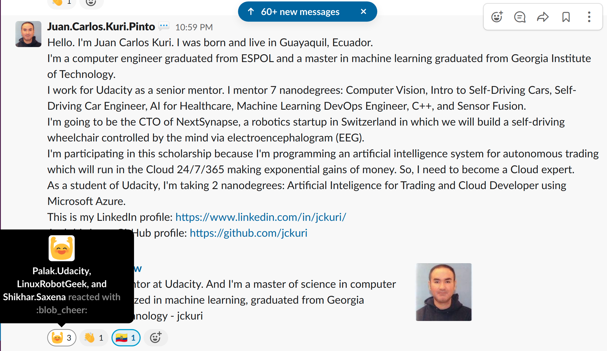

# Day 3: Wednesday, June 9, 2021.
- I tried to attend the `Program Orientation - Session #1`. But I could not enter due to the 500-user limit. :(
- I managed to attend the `Program Orientation - Session #2`.
- I asked a question for the `Program Orientation - Session #2` in the #ama_sesions channel. And Brenda selected my question.

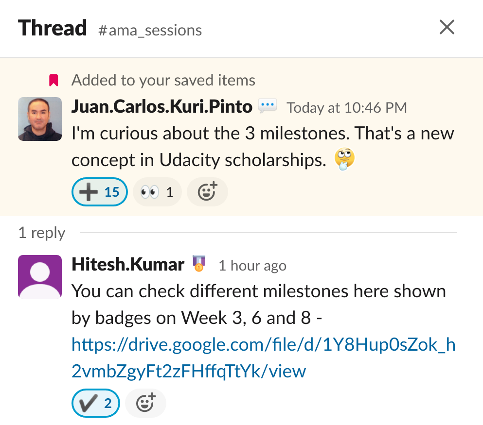
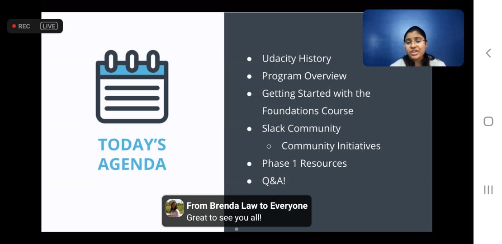

# Day 4: Thursday, June 10, 2021.
- I watched some video lectures.
- I'm in "Lesson 2: Architecture Consideration for Cloud Native Applications" - "5. Trade-offs for Monoliths and Microservices" (16% VIEWED)
- I managed to attend the `Slack Orientation`.

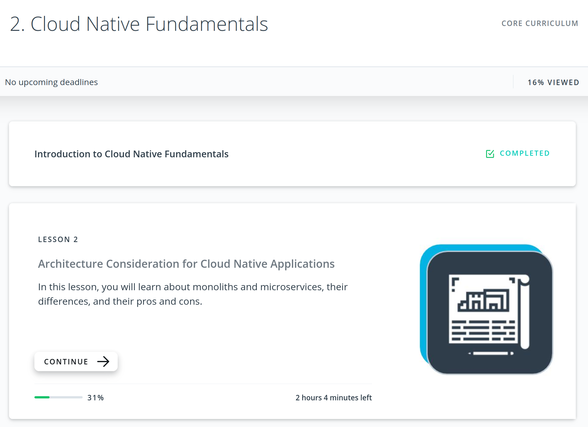
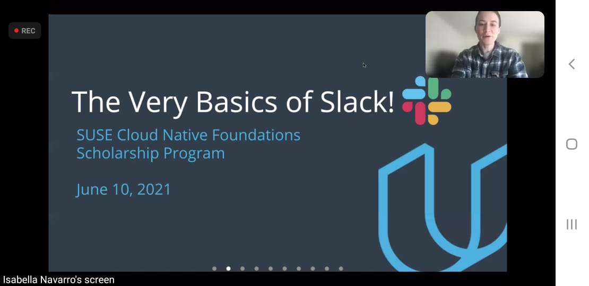

# Day 5: Friday, June 11, 2021.
- I watched some video lectures.
- I'm in "Lesson 2: Architecture Consideration for Cloud Native Applications" - "8. Solution: Monoliths and Microservices" (20% VIEWED)
- I read the documentation to form and join Study Teams: https://sites.google.com/udacity.com/suse-cloud-native-foundations/community/study-teams
- I created my own Study Team called Ecuador, which will unite scholars from Ecuador and we will probably have physical meetings in addition to our virtual meetings.

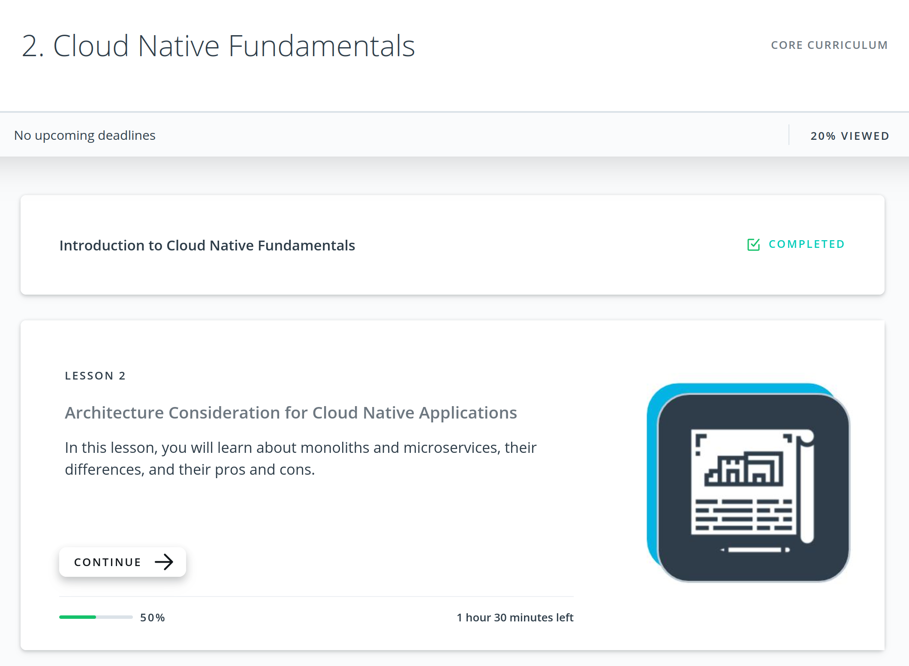
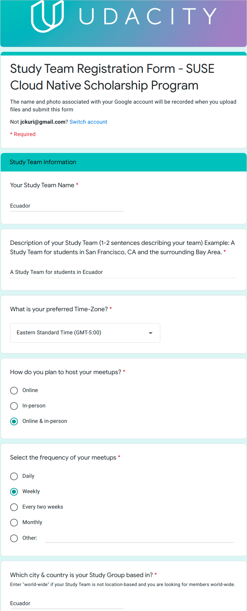
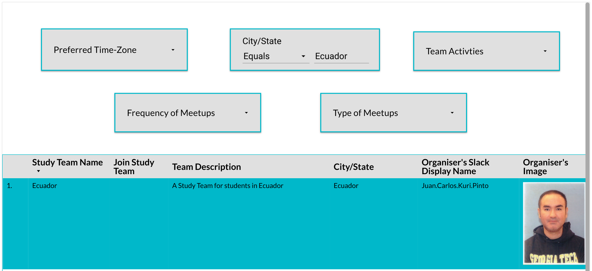

# Day 6: Saturday, June 12, 2021.
- I watched some video lectures.
- I completed Lesson 2 and I changed my badge to :milestone_1:
- I'm in "Lesson 3: Container Orchestration with Kubernetes" - "1. Introduction" (30% VIEWED)

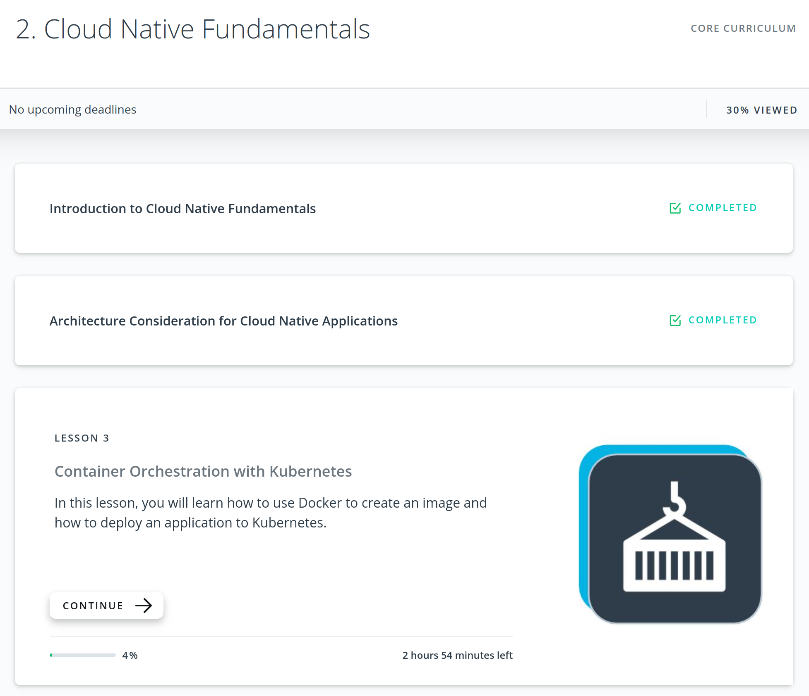


# Day 7: Sunday, June 13, 2021.
- I watched some video lectures.
- I'm in "Lesson 3: Container Orchestration with Kubernetes" - "3. Docker for Application Packaging" (32% VIEWED)


# Day 8: Monday, June 14, 2021.
- Yesterday: I completed Lesson 2 and I changed my badge to :milestone_1:
- Today: I read the official instructions for the Daily Scrum Challenge: https://sites.google.com/udacity.com/suse-cloud-native-foundations/community/daily-scrum-challenge
- Today: I filled the "Daily Scrum Challenge Sprint #1 - Commitment Form".
- Blockers: I'm insanely busy with my work as a Udacity mentor, trying to finish many certifications opportunities of the Sensor Fusion Nanodegree and Self-Driving Car Engineer Nanodegree.

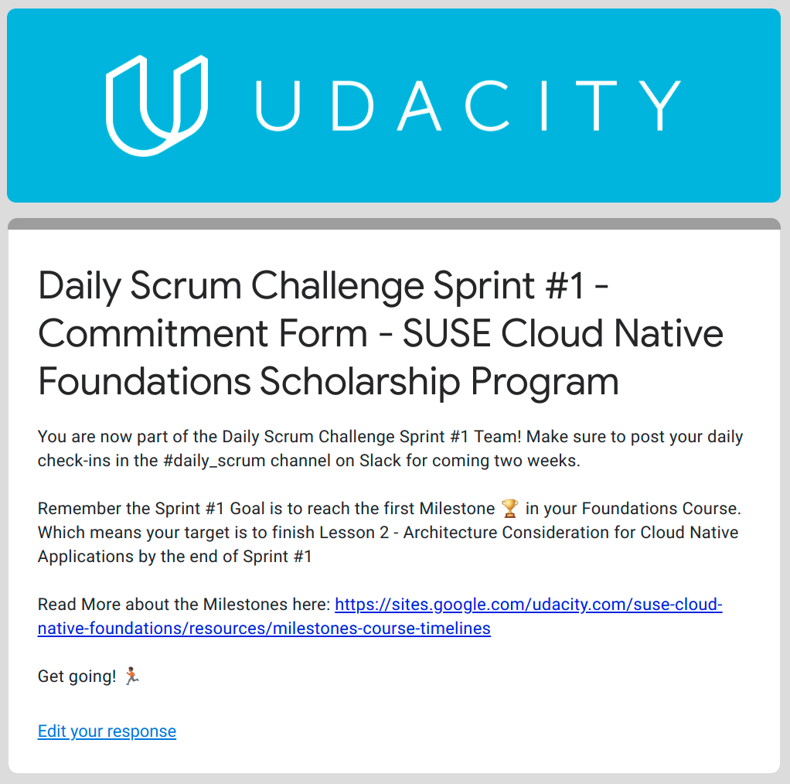

# Day 9: Tuesday, June 15, 2021.
- Yesterday: I read the official instructions for the Daily Scrum Challenge and I filled the "Daily Scrum Challenge Sprint #1 - Commitment Form".
- Today: I joined the study teams: #st_cloud_ai, #st_dotslash, #st_fintech, #st_ecuador 
- Today: I watched some video lectures.
- Today: I'm in "Lesson 3: Container Orchestration with Kubernetes" - "4. Docker Walkthrough" (33% VIEWED)
- Blockers: I'm very busy with my work as a Udacity mentor, trying to finish many certifications opportunities of the Sensor Fusion Nanodegree and Self-Driving Car Engineer Nanodegree.

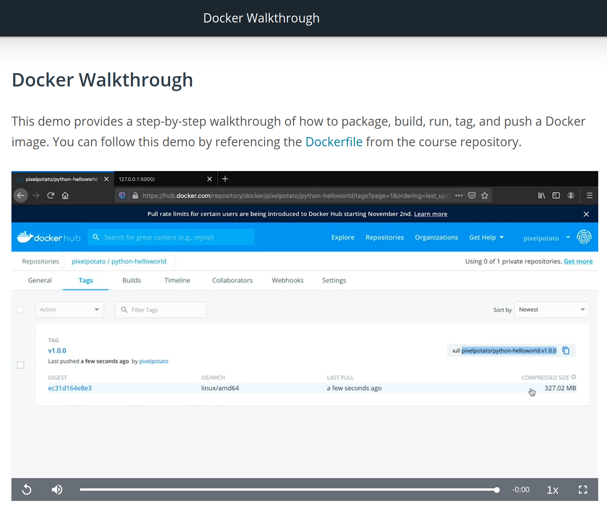
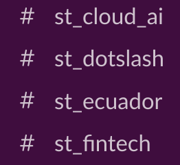

# Day 10: Wednesday, June 16, 2021.
- Yesterday: I joined the study teams: #st_cloud_ai, #st_dotslash, #st_fintech, #st_ecuador. And I watched some video lectures.
- Today: I watched some video lectures.
- Today: I'm in "Lesson 3: Container Orchestration with Kubernetes" - "6. Quizzes: Docker for Application Packaging" (36% VIEWED)
- Today: I'm organizing a webinar on artificial intelligence with @Prabor.Mukherjee for the Study Team #st_cloud_ai
- Blockers: I'm very busy with my work as a Udacity mentor, trying to finish many certifications opportunities of the Sensor Fusion Nanodegree and Self-Driving Car Engineer Nanodegree.
- Encouraging: @Carlota.Pearl @Katherine @Manuel.T @Camila.Andrea.Gonzalez.Williamson @KaustubhaShravan @Manasvi.Trivedi @Prabor.Mukherjee


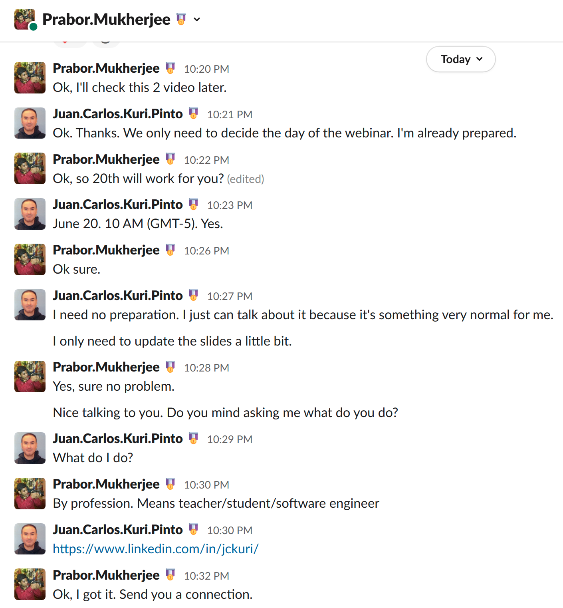
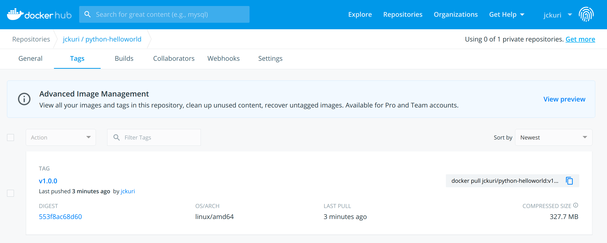

# Day 11: Thrusday, June 17, 2021.
- Yesterday: I watched some video lectures. I organized a webinar on artificial intelligence with @Prabor.Mukherjee for the Study Team #st_cloud_ai
- Today: I prepared the slides for our webinar in #st_cloud_ai about Deep Reinforcement Learning on this Sunday, June 20 at 10 AM (GMT-5) / 3 PM (GMT): http://bit.do/DeepRL3
- Blockers: I'm very busy with my work as a Udacity mentor, trying to finish many certifications opportunities of the Sensor Fusion Nanodegree and Self-Driving Car Engineer Nanodegree.
- Encouraging: @Carlota.Pearl @Katherine @Manuel.T @Camila.Andrea.Gonzalez.Williamson @KaustubhaShravan @Manasvi.Trivedi @Prabor.Mukherjee @susyjam 

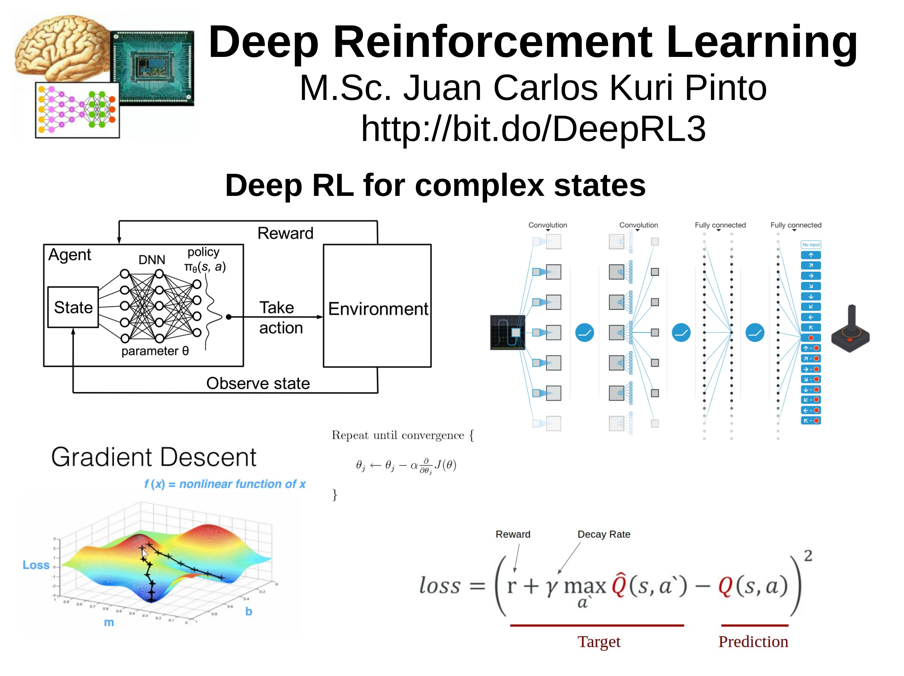

# Day 12: Friday, June 18, 2021.
- Yesterday: I prepared the slides for our webinar about Deep Reinforcement Learning.
- Today: @Prabor.Mukherjee and I tested the functionalities of Google Meet: Screen sharing, video call link, and video recording. Here is the complete and updated information of our Deep RL webinar:
```
Webinar of the Study Team #st_cloud_ai 
Topic: Deep Reinforcement Learning
Date: Sunday, June 20, 2021
Time: 10 AM (GMT-5) / 3 PM (GMT)
Slides: http://bit.do/DeepRL3
Video call link: https://meet.google.com/psv-ispj-mfk
Speaker: @Juan.Carlos.Kuri.Pinto
Moderator: @Prabor.Mukherjee
```
- I added the webinar to the official calendar: https://sites.google.com/udacity.com/suse-cloud-native-foundations/calendar
- Blockers: I'm very busy with my work as a Udacity mentor, trying to finish many certifications opportunities of the Sensor Fusion Nanodegree and Self-Driving Car Engineer Nanodegree.
- Encouraging: @Carlota.Pearl @Katherine @Manuel.T @Camila.Andrea.Gonzalez.Williamson @KaustubhaShravan @Manasvi.Trivedi @Prabor.Mukherjee @susyjam 

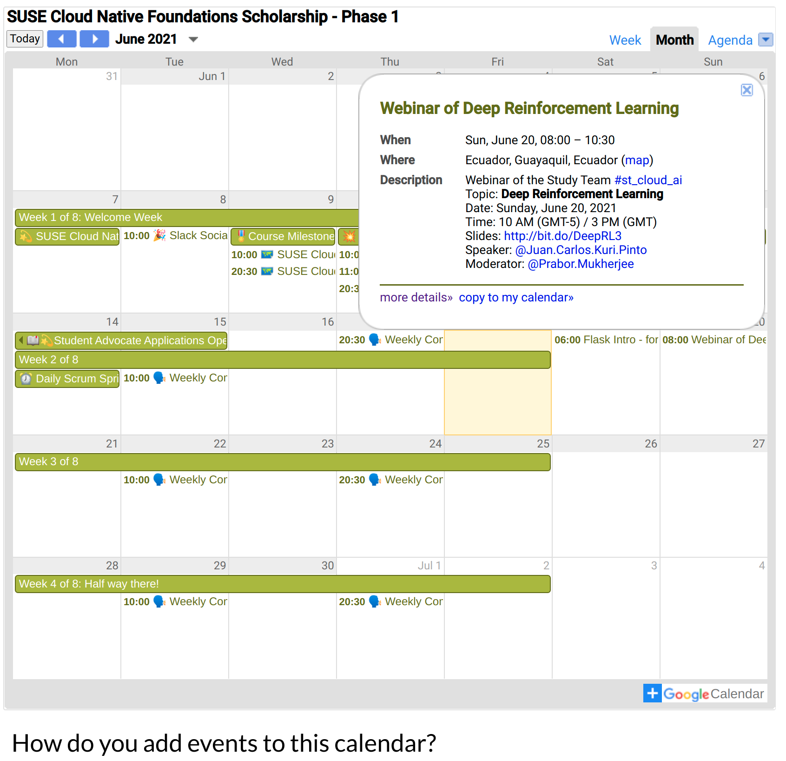

# Day 13: Saturday, June 19, 2021.
- Yesterday: @Prabor.Mukherjee and I tested the functionalities of Google Meet: Screen sharing, video call link, and video recording. And we added the webinar to the official calendar.
- Today: I was reading the slides of our Deep RL webinar for tomorrow:<br/>
```
Webinar of the Study Team #st_cloud_ai 
Topic: Deep Reinforcement Learning
Date: Sunday, June 20, 2021
Time: 10 AM (GMT-5) / 3 PM (GMT)
Slides: http://bit.do/DeepRL3
Video call link: https://meet.google.com/psv-ispj-mfk
Speaker: @Juan.Carlos.Kuri.Pinto
Moderator: @Prabor.Mukherjee
```
- Today: I watched some video lectures and completed some programming exercises.
- Today: I'm in "Lesson 3: Container Orchestration with Kubernetes" - "8. Solution: Docker for Application Packaging" (38% VIEWED)
- Today: I read the contents of the following link.<br/>
Manage Docker as a non-root user<br/>
https://docs.docker.com/engine/install/linux-postinstall/#manage-docker-as-a-non-root-user
- Today: I read the contents of the following link.<br/>
go: go.mod file not found in current directory or any parent directory; see 'go help modules'<br/>
https://stackoverflow.com/questions/66894200/go-go-mod-file-not-found-in-current-directory-or-any-parent-directory-see-go
- Blockers: I'm very busy with my work as a Udacity mentor, trying to finish many certifications opportunities of the Sensor Fusion Nanodegree and Self-Driving Car Engineer Nanodegree.
- Encouraging: @Carlota.Pearl @Katherine @Manuel.T @Camila.Andrea.Gonzalez.Williamson @KaustubhaShravan @Manasvi.Trivedi @Prabor.Mukherjee @susyjam 

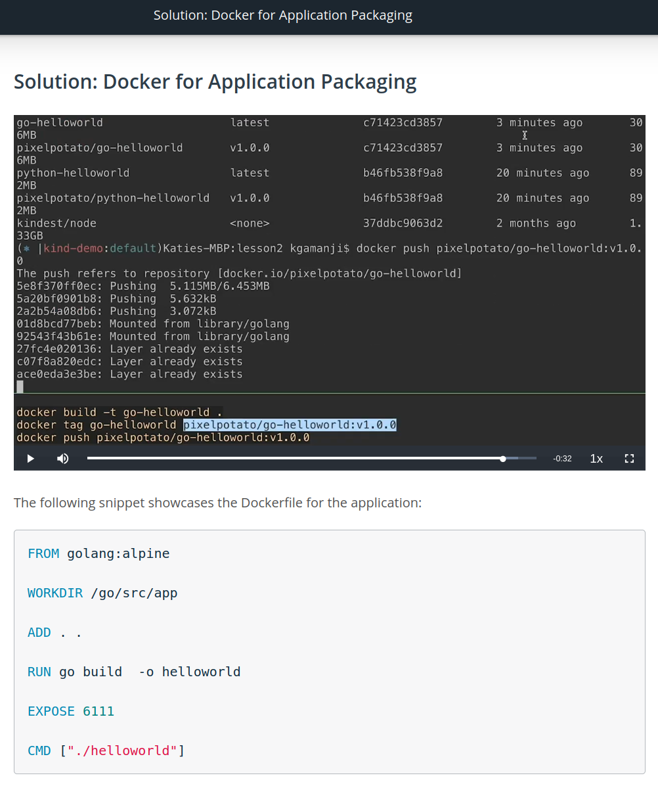

# Day 14: Sunday, June 20, 2021.
- Yesterday: I prepared the webinar of Deep RL. I watched some video lectures. I read some articles.
- Today: We gave the webinar of Deep Reinforcement Learning: https://youtu.be/uzEdwfAYP60
- Today: I filled the form of "Student Led Events/ Initiatives": https://sites.google.com/udacity.com/suse-cloud-native-foundations/community/student-led-initiativesevents
- Blockers: I'm very busy with my work as a Udacity mentor, trying to finish many certifications opportunities of the Sensor Fusion Nanodegree and Self-Driving Car Engineer Nanodegree.
- Encouraging: @Carlota.Pearl @Katherine @Manuel.T @Camila.Andrea.Gonzalez.Williamson @KaustubhaShravan @Manasvi.Trivedi @Prabor.Mukherjee @susyjam 

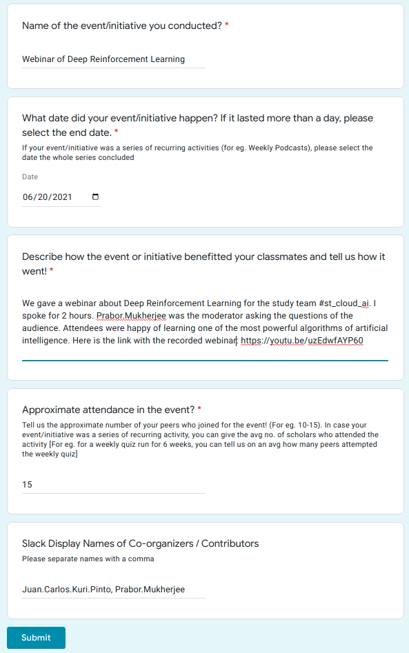
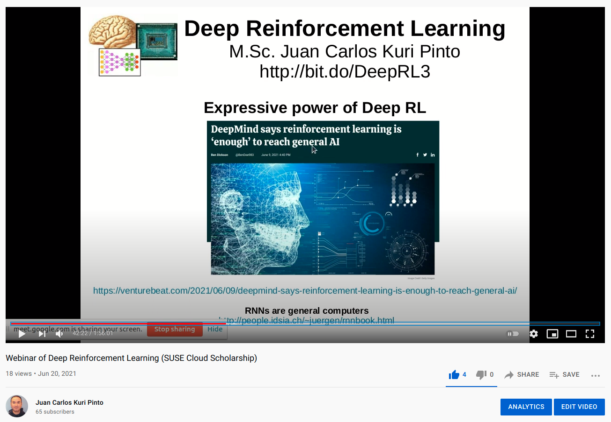

# Day 15: Monday, June 21, 2021.
- Yesterday: I gave a webinar on Deep Reinforcement Learning. And I filled the form of "Student Led Events/ Initiatives".
- Today: I watched some video lectures and completed some exercises.
- Today: I'm in "Lesson 3: Container Orchestration with Kubernetes" - "11. Deploy Your First Kubernetes Cluster" (41% VIEWED)
- Blockers: I'm very busy with my work as a Udacity mentor, trying to finish many certifications opportunities of the Sensor Fusion Nanodegree and Self-Driving Car Engineer Nanodegree.
- Encouraging: @Carlota.Pearl @Katherine @Manuel.T @Camila.Andrea.Gonzalez.Williamson @KaustubhaShravan @Manasvi.Trivedi @Prabor.Mukherjee @susyjam 

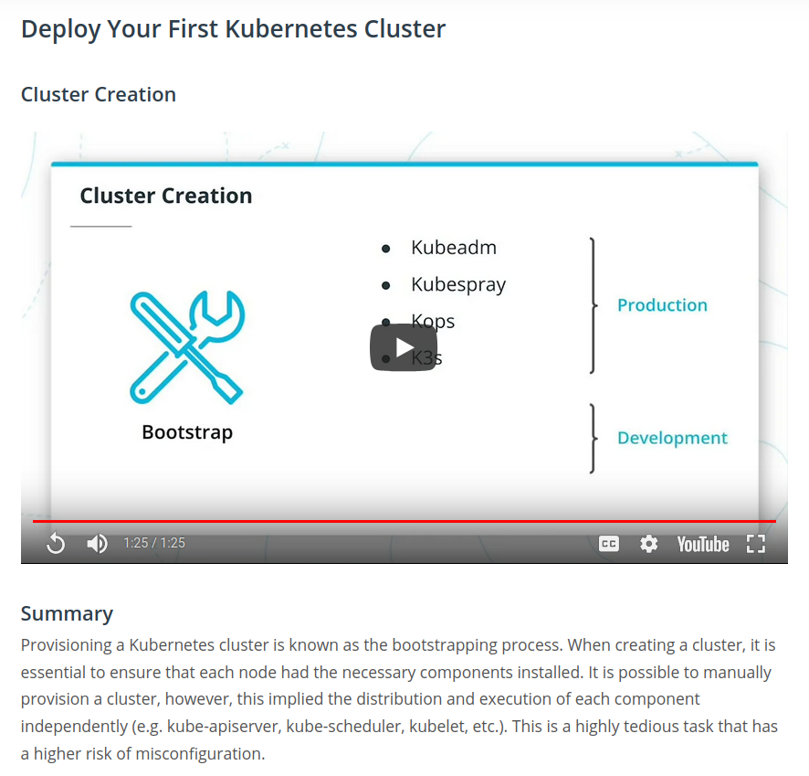

# Day 16: Tuesday, June 22, 2021.
