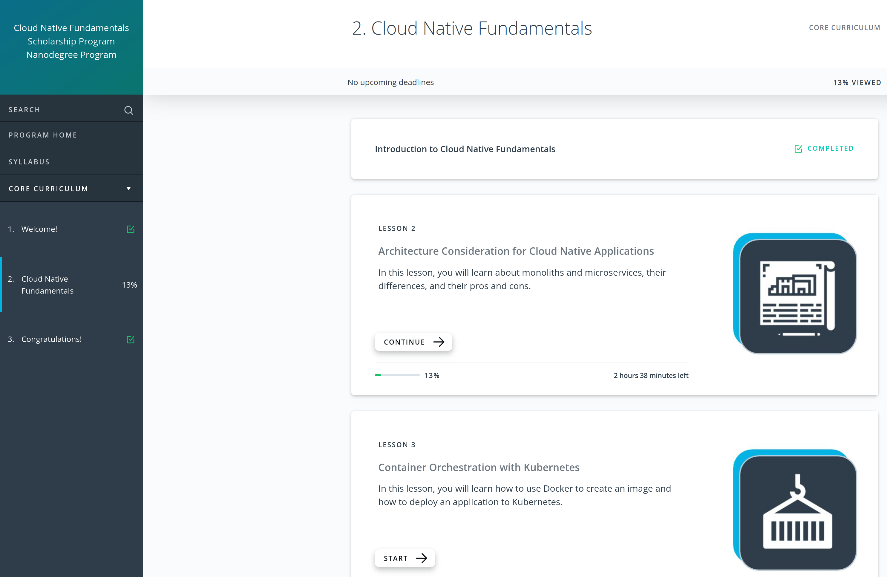

# 2_Months_of_SUSE_Scholarship

# Day 1: Monday, June 7, 2021.
- I registered to the Slack channel: https://susecloudchallenge.slack.com/
- I entered the classroom at: https://classroom.udacity.com/nanodegrees/nd064-1/dashboard/overview
- I watched some video lectures.
- I'm in "Lesson 2: Architecture Consideration for Cloud Native Applications" - "2. Design Considerations for Cloud-Native Applications" (13% VIEWED)

# Day 2: Tuesday, June 8, 2021.
- I read all the activities to be done in the official website of this scholarship: https://sites.google.com/udacity.com/suse-cloud-native-foundations/home
- I introduced myself in the Slack channel #welcome.

# Day 3: Wednesday, June 9, 2021.
- I tried to attend the `Program Orientation - Session #1`. But I could not enter due to the 500-user limit. :(
- I managed to attend the `Program Orientation - Session #2`.
- I asked a question for the `Program Orientation - Session #2` in the #ama_sesions channel. And Brenda selected my question.

# Day 4: Thursday, June 10, 2021.
- I watched some video lectures.
- I'm in "Lesson 2: Architecture Consideration for Cloud Native Applications" - "5. Trade-offs for Monoliths and Microservices" (16% VIEWED)
- I managed to attend the `Slack Orientation`.

