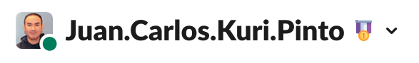

# 2_Months_of_SUSE_Scholarship

# Day 1: Monday, June 7, 2021.
- I registered to the Slack channel: https://susecloudchallenge.slack.com/
- I entered the classroom at: https://classroom.udacity.com/nanodegrees/nd064-1/dashboard/overview
- I watched some video lectures.
- I'm in "Lesson 2: Architecture Consideration for Cloud Native Applications" - "2. Design Considerations for Cloud-Native Applications" (13% VIEWED)

# Day 2: Tuesday, June 8, 2021.
- I read all the activities to be done in the official website of this scholarship: https://sites.google.com/udacity.com/suse-cloud-native-foundations/home
- I introduced myself in the Slack channel #welcome.

# Day 3: Wednesday, June 9, 2021.
- I tried to attend the `Program Orientation - Session #1`. But I could not enter due to the 500-user limit. :(
- I managed to attend the `Program Orientation - Session #2`.
- I asked a question for the `Program Orientation - Session #2` in the #ama_sesions channel. And Brenda selected my question.

# Day 4: Thursday, June 10, 2021.
- I watched some video lectures.
- I'm in "Lesson 2: Architecture Consideration for Cloud Native Applications" - "5. Trade-offs for Monoliths and Microservices" (16% VIEWED)
- I managed to attend the `Slack Orientation`.

# Day 5: Friday, June 11, 2021.
- I watched some video lectures.
- I'm in "Lesson 2: Architecture Consideration for Cloud Native Applications" - "8. Solution: Monoliths and Microservices" (20% VIEWED)
- I read the documentation to form and join Study Teams: https://sites.google.com/udacity.com/suse-cloud-native-foundations/community/study-teams
- I created my own Study Team called Ecuador, which will unite scholars from Ecuador and we will probably have physical meetings in addition to our virtual meetings.

# Day 6: Saturday, June 12, 2021.
- I watched some video lectures.
- I completed Lesson 2 and I changed my badge to :milestone_1:
- I'm in "Lesson 3: Container Orchestration with Kubernetes" - "1. Introduction" (30% VIEWED)

# Day 7: Sunday, June 13, 2021.
- I watched some video lectures.
- I'm in "Lesson 3: Container Orchestration with Kubernetes" - "3. Docker for Application Packaging" (32% VIEWED)

# Day 8: Monday, June 14, 2021.
- Yesterday: I completed Lesson 2 and I changed my badge to :milestone_1:
- Today: I read the official instructions for the Daily Scrum Challenge: https://sites.google.com/udacity.com/suse-cloud-native-foundations/community/daily-scrum-challenge
- Today: I filled the "Daily Scrum Challenge Sprint #1 - Commitment Form".
- Blockers: I'm insanely busy with my work as a Udacity mentor, trying to finish many certifications opportunities of the Sensor Fusion Nanodegree and Self-Driving Car Engineer Nanodegree.

# Day 9: Tuesday, June 15, 2021.
- Yesterday: I read the official instructions for the Daily Scrum Challenge and I filled the "Daily Scrum Challenge Sprint #1 - Commitment Form".
- Today: I joined the study teams: #st_cloud_ai, #st_dotslash, #st_fintech, #st_ecuador 
- Today: I watched some video lectures.
- Today: I'm in "Lesson 3: Container Orchestration with Kubernetes" - "4. Docker Walkthrough" (33% VIEWED)
- Blockers: I'm very busy with my work as a Udacity mentor, trying to finish many certifications opportunities of the Sensor Fusion Nanodegree and Self-Driving Car Engineer Nanodegree.

# Day 10: Wednesday, June 16, 2021.
- Yesterday: I joined the study teams: #st_cloud_ai, #st_dotslash, #st_fintech, #st_ecuador. And I watched some video lectures.
- Today: I watched some video lectures.
- Today: I'm in "Lesson 3: Container Orchestration with Kubernetes" - "6. Quizzes: Docker for Application Packaging" (36% VIEWED)
- Today: I'm organizing a webinar on artificial intelligence with @Prabor.Mukherjee for the Study Team #st_cloud_ai
- Blockers: I'm very busy with my work as a Udacity mentor, trying to finish many certifications opportunities of the Sensor Fusion Nanodegree and Self-Driving Car Engineer Nanodegree.
- Encouraging: @Carlota.Pearl @Katherine @Manuel.T @Camila.Andrea.Gonzalez.Williamson @KaustubhaShravan @Manasvi.Trivedi @Prabor.Mukherjee

