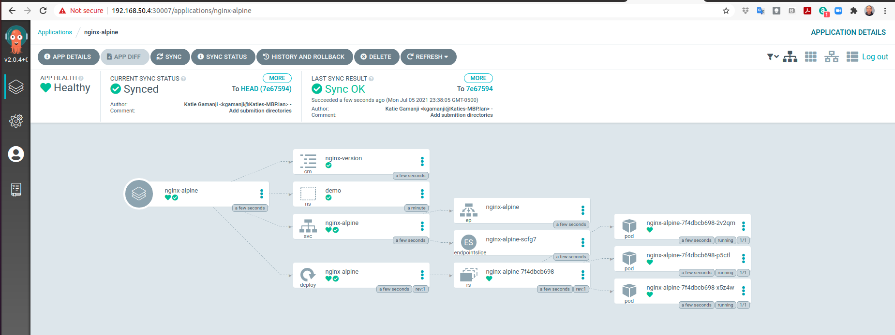
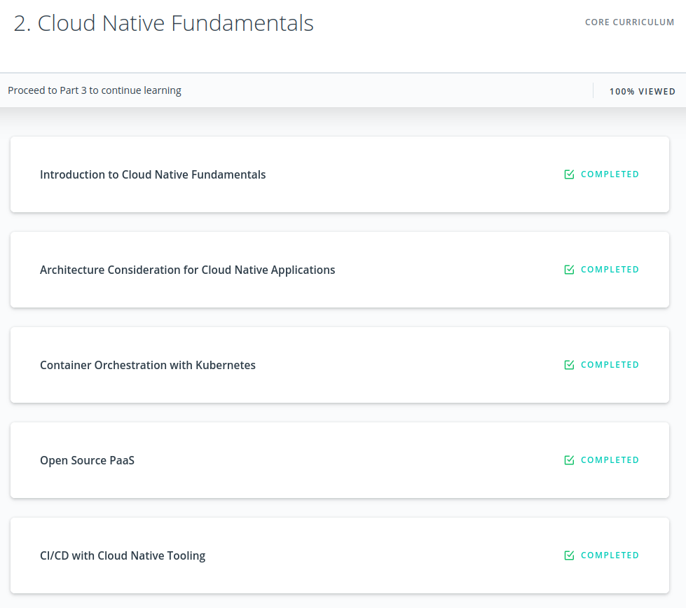

# 2_Months_of_SUSE_Scholarship

# Day 1: Monday, June 7, 2021.
- I registered to the Slack channel: https://susecloudchallenge.slack.com/
- I entered the classroom at: https://classroom.udacity.com/nanodegrees/nd064-1/dashboard/overview
- I watched some video lectures.
- I'm in "Lesson 2: Architecture Consideration for Cloud Native Applications" - "2. Design Considerations for Cloud-Native Applications" (13% VIEWED)


# Day 2: Tuesday, June 8, 2021.
- I read all the activities to be done in the official website of this scholarship: https://sites.google.com/udacity.com/suse-cloud-native-foundations/home
- I introduced myself in the Slack channel #welcome.


# Day 3: Wednesday, June 9, 2021.
- I tried to attend the `Program Orientation - Session #1`. But I could not enter due to the 500-user limit. :(
- I managed to attend the `Program Orientation - Session #2`.
- I asked a question for the `Program Orientation - Session #2` in the #ama_sesions channel. And Brenda selected my question.


# Day 4: Thursday, June 10, 2021.
- I watched some video lectures.
- I'm in "Lesson 2: Architecture Consideration for Cloud Native Applications" - "5. Trade-offs for Monoliths and Microservices" (16% VIEWED)
- I managed to attend the `Slack Orientation`.


# Day 5: Friday, June 11, 2021.
- I watched some video lectures.
- I'm in "Lesson 2: Architecture Consideration for Cloud Native Applications" - "8. Solution: Monoliths and Microservices" (20% VIEWED)
- I read the documentation to form and join Study Teams: https://sites.google.com/udacity.com/suse-cloud-native-foundations/community/study-teams
- I created my own Study Team called Ecuador, which will unite scholars from Ecuador and we will probably have physical meetings in addition to our virtual meetings.


# Day 6: Saturday, June 12, 2021.
- I watched some video lectures.
- I completed Lesson 2 and I changed my badge to :milestone_1:
- I'm in "Lesson 3: Container Orchestration with Kubernetes" - "1. Introduction" (30% VIEWED)


# Day 7: Sunday, June 13, 2021.
- I watched some video lectures.
- I'm in "Lesson 3: Container Orchestration with Kubernetes" - "3. Docker for Application Packaging" (32% VIEWED)


# Day 8: Monday, June 14, 2021.
- Yesterday: I completed Lesson 2 and I changed my badge to :milestone_1:
- Today: I read the official instructions for the Daily Scrum Challenge: https://sites.google.com/udacity.com/suse-cloud-native-foundations/community/daily-scrum-challenge
- Today: I filled the "Daily Scrum Challenge Sprint #1 - Commitment Form".
- Blockers: I'm insanely busy with my work as a Udacity mentor, trying to finish many certifications opportunities of the Sensor Fusion Nanodegree and Self-Driving Car Engineer Nanodegree.


# Day 9: Tuesday, June 15, 2021.
- Yesterday: I read the official instructions for the Daily Scrum Challenge and I filled the "Daily Scrum Challenge Sprint #1 - Commitment Form".
- Today: I joined the study teams: #st_cloud_ai, #st_dotslash, #st_fintech, #st_ecuador 
- Today: I watched some video lectures.
- Today: I'm in "Lesson 3: Container Orchestration with Kubernetes" - "4. Docker Walkthrough" (33% VIEWED)
- Blockers: I'm very busy with my work as a Udacity mentor, trying to finish many certifications opportunities of the Sensor Fusion Nanodegree and Self-Driving Car Engineer Nanodegree.


# Day 10: Wednesday, June 16, 2021.
- Yesterday: I joined the study teams: #st_cloud_ai, #st_dotslash, #st_fintech, #st_ecuador. And I watched some video lectures.
- Today: I watched some video lectures.
- Today: I'm in "Lesson 3: Container Orchestration with Kubernetes" - "6. Quizzes: Docker for Application Packaging" (36% VIEWED)
- Today: I'm organizing a webinar on artificial intelligence with @Prabor.Mukherjee for the Study Team #st_cloud_ai
- Blockers: I'm very busy with my work as a Udacity mentor, trying to finish many certifications opportunities of the Sensor Fusion Nanodegree and Self-Driving Car Engineer Nanodegree.
- Encouraging: @Carlota.Pearl @Katherine @Manuel.T @Camila.Andrea.Gonzalez.Williamson @KaustubhaShravan @Manasvi.Trivedi @Prabor.Mukherjee


# Day 11: Thrusday, June 17, 2021.
- Yesterday: I watched some video lectures. I organized a webinar on artificial intelligence with @Prabor.Mukherjee for the Study Team #st_cloud_ai
- Today: I prepared the slides for our webinar in #st_cloud_ai about Deep Reinforcement Learning on this Sunday, June 20 at 10 AM (GMT-5) / 3 PM (GMT): http://bit.do/DeepRL3
- Blockers: I'm very busy with my work as a Udacity mentor, trying to finish many certifications opportunities of the Sensor Fusion Nanodegree and Self-Driving Car Engineer Nanodegree.
- Encouraging: @Carlota.Pearl @Katherine @Manuel.T @Camila.Andrea.Gonzalez.Williamson @KaustubhaShravan @Manasvi.Trivedi @Prabor.Mukherjee @susyjam 


# Day 12: Friday, June 18, 2021.
- Yesterday: I prepared the slides for our webinar about Deep Reinforcement Learning.
- Today: @Prabor.Mukherjee and I tested the functionalities of Google Meet: Screen sharing, video call link, and video recording. Here is the complete and updated information of our Deep RL webinar:
```
Webinar of the Study Team #st_cloud_ai 
Topic: Deep Reinforcement Learning
Date: Sunday, June 20, 2021
Time: 10 AM (GMT-5) / 3 PM (GMT)
Slides: http://bit.do/DeepRL3
Video call link: https://meet.google.com/psv-ispj-mfk
Speaker: @Juan.Carlos.Kuri.Pinto
Moderator: @Prabor.Mukherjee
```
- I added the webinar to the official calendar: https://sites.google.com/udacity.com/suse-cloud-native-foundations/calendar
- Blockers: I'm very busy with my work as a Udacity mentor, trying to finish many certifications opportunities of the Sensor Fusion Nanodegree and Self-Driving Car Engineer Nanodegree.
- Encouraging: @Carlota.Pearl @Katherine @Manuel.T @Camila.Andrea.Gonzalez.Williamson @KaustubhaShravan @Manasvi.Trivedi @Prabor.Mukherjee @susyjam 


# Day 13: Saturday, June 19, 2021.
- Yesterday: @Prabor.Mukherjee and I tested the functionalities of Google Meet: Screen sharing, video call link, and video recording. And we added the webinar to the official calendar.
- Today: I was reading the slides of our Deep RL webinar for tomorrow:<br/>
```
Webinar of the Study Team #st_cloud_ai 
Topic: Deep Reinforcement Learning
Date: Sunday, June 20, 2021
Time: 10 AM (GMT-5) / 3 PM (GMT)
Slides: http://bit.do/DeepRL3
Video call link: https://meet.google.com/psv-ispj-mfk
Speaker: @Juan.Carlos.Kuri.Pinto
Moderator: @Prabor.Mukherjee
```
- Today: I watched some video lectures and completed some programming exercises.
- Today: I'm in "Lesson 3: Container Orchestration with Kubernetes" - "8. Solution: Docker for Application Packaging" (38% VIEWED)
- Today: I read the contents of the following link.<br/>
Manage Docker as a non-root user<br/>
https://docs.docker.com/engine/install/linux-postinstall/#manage-docker-as-a-non-root-user
- Today: I read the contents of the following link.<br/>
go: go.mod file not found in current directory or any parent directory; see 'go help modules'<br/>
https://stackoverflow.com/questions/66894200/go-go-mod-file-not-found-in-current-directory-or-any-parent-directory-see-go
- Blockers: I'm very busy with my work as a Udacity mentor, trying to finish many certifications opportunities of the Sensor Fusion Nanodegree and Self-Driving Car Engineer Nanodegree.
- Encouraging: @Carlota.Pearl @Katherine @Manuel.T @Camila.Andrea.Gonzalez.Williamson @KaustubhaShravan @Manasvi.Trivedi @Prabor.Mukherjee @susyjam 


# Day 14: Sunday, June 20, 2021.
- Yesterday: I prepared the webinar of Deep RL. I watched some video lectures. I read some articles.
- Today: We gave the webinar of Deep Reinforcement Learning: https://youtu.be/uzEdwfAYP60
- Today: I filled the form of "Student Led Events/ Initiatives": https://sites.google.com/udacity.com/suse-cloud-native-foundations/community/student-led-initiativesevents
- Blockers: I'm very busy with my work as a Udacity mentor, trying to finish many certifications opportunities of the Sensor Fusion Nanodegree and Self-Driving Car Engineer Nanodegree.
- Encouraging: @Carlota.Pearl @Katherine @Manuel.T @Camila.Andrea.Gonzalez.Williamson @KaustubhaShravan @Manasvi.Trivedi @Prabor.Mukherjee @susyjam 


# Day 15: Monday, June 21, 2021.
- Yesterday: I gave a webinar on Deep Reinforcement Learning. And I filled the form of "Student Led Events/ Initiatives".
- Today: I watched some video lectures and completed some exercises.
- Today: I'm in "Lesson 3: Container Orchestration with Kubernetes" - "11. Deploy Your First Kubernetes Cluster" (41% VIEWED)
- Blockers: I'm very busy with my work as a Udacity mentor, trying to finish many certifications opportunities of the Sensor Fusion Nanodegree and Self-Driving Car Engineer Nanodegree.
- Encouraging: @Carlota.Pearl @Katherine @Manuel.T @Camila.Andrea.Gonzalez.Williamson @KaustubhaShravan @Manasvi.Trivedi @Prabor.Mukherjee @susyjam @AndyP 


# Day 16: Tuesday, June 22, 2021.
- Yesterday: I watched some video lectures and completed some exercises.
- Today: I learned about K3s, a lightweight Kubernetes, in its website: https://k3s.io/
- Blockers: I'm very busy with my work as a Udacity mentor, trying to finish many certifications opportunities of the Sensor Fusion Nanodegree and Self-Driving Car Engineer Nanodegree.
- Encouraging: @Carlota.Pearl @Katherine @Manuel.T @Camila.Andrea.Gonzalez.Williamson @KaustubhaShravan @Manasvi.Trivedi @Prabor.Mukherjee @susyjam @AndyP 


# Day 17: Wednesday, June 23, 2021.
- Yesterday: I learned about K3s, a lightweight Kubernetes, in its website: https://k3s.io/
- Today: I watched some video lectures and completed some exercises.
- Today: I'm in "Lesson 3: Container Orchestration with Kubernetes" - "12. Kubeconfig" (43% VIEWED)
- Blockers: I'm very busy with my work as a Udacity mentor, trying to finish many certifications opportunities of the Self-Driving Car Engineer Nanodegree.
- Encouraging: @Carlota.Pearl @Katherine @Manuel.T @Camila.Andrea.Gonzalez.Williamson @KaustubhaShravan @Manasvi.Trivedi @Prabor.Mukherjee @susyjam @AndyP 


# Day 18: Thursday, June 24, 2021.

- Yesterday: I watched some video lectures and completed some exercises.
- Today: I watched some video lectures and completed some exercises.
- Today: I'm in "Lesson 3: Container Orchestration with Kubernetes" - "14. Exercise: Deploy Your First Kubernetes Cluster" (45% VIEWED)
- Today: I interacted with some Ecuadorians in our Study Team #st_ecuador.
- Blockers: I'm very busy with my work as a Udacity mentor, trying to finish many certifications opportunities of the Self-Driving Car Engineer Nanodegree.
- Encouraging: @Carlota.Pearl @Katherine @Manuel.T @Camila.Andrea.Gonzalez.Williamson @KaustubhaShravan @Manasvi.Trivedi @Prabor.Mukherjee @susyjam @AndyP @Jorge.Barrera @Ivan @MartinaF. @Jose.Vera @Juan.Carlos.Jimenez @Frida 


# Day 19: Friday, June 25, 2021.

- Yesterday: I watched some video lectures and completed some exercises. And I interacted with some Ecuadorians in our Study Team #st_ecuador.
- Today: I watched some video lectures and completed some exercises.
- Today: I'm in "Lesson 3: Container Orchestration with Kubernetes" - "15. Solution: Deploy Your First Kubernetes Cluster" (46% VIEWED)
- Today: I'm trying to add my "Webinar of Deep Reinforcement Learning" https://youtu.be/uzEdwfAYP60 to our Resources Airtable: https://airtable.com/shryLSJS4CQslJBO9/tbl6A99RXoOm7DYSJ But I still don't know the tool.
- Blockers: I'm very busy with my work as a Udacity mentor, trying to finish many certifications opportunities of the Self-Driving Car Engineer Nanodegree.
- Encouraging: @Carlota.Pearl @Katherine @Manuel.T @Camila.Andrea.Gonzalez.Williamson @KaustubhaShravan @Manasvi.Trivedi @Prabor.Mukherjee @susyjam @AndyP @Jorge.Barrera @Ivan @MartinaF. @Jose.Vera @Juan.Carlos.Jimenez @Frida 


# Day 20: Saturday, June 26, 2021.

- Yesterday: I watched some video lectures and completed some exercises.
- Today: I watched some video lectures and completed some exercises.
- Today: I'm in "Lesson 3: Container Orchestration with Kubernetes" - "17. Kubernetes Resources Part 2" (47% VIEWED)
- Blockers: I'm very busy with my work as a Udacity mentor, trying to finish many certifications opportunities of the Self-Driving Car Engineer Nanodegree.
- Encouraging: @Carlota.Pearl @Katherine @Manuel.T @Camila.Andrea.Gonzalez.Williamson @KaustubhaShravan @Manasvi.Trivedi @Prabor.Mukherjee @susyjam @AndyP @Jorge.Barrera @Ivan @MartinaF. @Jose.Vera @Juan.Carlos.Jimenez @Frida 


# Day 21: Sunday, June 27, 2021.

- Yesterday: I watched some video lectures and completed some exercises.
- Today: I did some experiments with Vagrant, K3s, and Docker Hub.
- Blockers: My experiments failed miserably. :D I got a CreateContainerError and I don't know what to do next.
- Blockers: I'm very busy with my work as a Udacity mentor, trying to finish many certifications opportunities of the Self-Driving Car Engineer Nanodegree.
- Encouraging: @Carlota.Pearl @Katherine @Manuel.T @Camila.Andrea.Gonzalez.Williamson @KaustubhaShravan @Manasvi.Trivedi @Prabor.Mukherjee @susyjam @AndyP @Jorge.Barrera @Ivan @MartinaF. @Jose.Vera @Juan.Carlos.Jimenez @Frida 


# Day 22: Monday, June 28, 2021.

- Yesterday: I did some experiments with Vagrant, K3s, and Docker Hub. And my experiments failed miserably. :D 
- Today: I watched some video lectures and completed some exercises.
- Today: I'm in "Lesson 3: Container Orchestration with Kubernetes" - "23. Declarative Kubernetes Manifests" (55% VIEWED)
- Today: @Carlota.Pearl helped me to submit my Webinar of Deep Reinforcement Learning <https://youtu.be/uzEdwfAYP60> to our Resources Airtable <https://airtable.com/shryLSJS4CQslJBO9/tbl6A99RXoOm7DYSJ>
- Today: @Frida helped me to overcome the blocker I had yesterday by suggesting me to use the command `zypper install -t pattern apparmor` after executing the commands `vagrant ssh` and `sudo su -`.
- Blockers: I'm very busy with my work as a Udacity mentor, trying to finish many certifications opportunities of the nanodegrees Machine Learning DevOps Engineer and Self-Driving Car Engineer.
- Encouraging: @Carlota.Pearl @Katherine @Manuel.T @Camila.Andrea.Gonzalez.Williamson @KaustubhaShravan @Manasvi.Trivedi @Prabor.Mukherjee @susyjam @AndyP @Jorge.Barrera @Ivan @MartinaF. @Jose.Vera @Juan.Carlos.Jimenez @Frida 


# Day 23: Tuesday, June 29, 2021.

- Yesterday: I watched some video lectures and completed some exercises.
- Yesterday: I submitted my Webinar of Deep Reinforcement Learning <https://youtu.be/uzEdwfAYP60> to our Resources Airtable <https://airtable.com/shryLSJS4CQslJBO9/tbl6A99RXoOm7DYSJ>
- Today: I filled the completion form for the Sprint #1 and I got my badge.
- Today: I submitted my story for the Student Stories Challenge.
- Blockers: I'm very busy with my work as a Udacity mentor, trying to finish many certifications opportunities of the nanodegrees Machine Learning DevOps Engineer and Self-Driving Car Engineer.
- Encouraging: @Carlota.Pearl @Katherine @Manuel.T @Camila.Andrea.Gonzalez.Williamson @KaustubhaShravan @Manasvi.Trivedi @Prabor.Mukherjee @susyjam @AndyP @Jorge.Barrera @Ivan @MartinaF. @Jose.Vera @Juan.Carlos.Jimenez @Frida 


# Day 24: Wednesday, June 30, 2021.

- Yesterday: I filled the completion form for the Sprint #1 and I got my badge.
- Yesterday: I submitted my story for the Student Stories Challenge.
- Today: I finished Lesson 3: "Container Orchestration with Kubernetes".
- Today: I finished Lesson 4: "Open Source PaaS" and I got my badge :milestone_2:
- Today: I'm in "Lesson 5: CI/CD with Cloud Native Tooling" - "1. Introduction" (78% VIEWED)
- Blockers: I'm very busy with my work as a Udacity mentor, trying to finish many certifications opportunities of the nanodegrees Machine Learning DevOps Engineer and Self-Driving Car Engineer.
- Encouraging: @Carlota.Pearl @Katherine @Manuel.T @Camila.Andrea.Gonzalez.Williamson @KaustubhaShravan @Manasvi.Trivedi @Prabor.Mukherjee @susyjam @AndyP @Jorge.Barrera @Ivan @MartinaF. @Jose.Vera @Juan.Carlos.Jimenez @Frida 


# Day 25: Thursday, July 1, 2021.

- Yesterday: I finished Lesson 3: "Container Orchestration with Kubernetes".
- Yesterday: I finished Lesson 4: "Open Source PaaS" and I got my badge :milestone_2:
- Today: I submitted the feedback survey of the SUSE Scholarship program.
- Today: I watched some video lectures and completed some exercises.
- Today: I'm in "Lesson 5: CI/CD with Cloud Native Tooling" - "7. Exercise: The CI Fundamentals" (85% VIEWED)
- Blockers: I'm very busy with my work as a Udacity mentor, trying to finish many certifications opportunities of the nanodegrees Machine Learning DevOps Engineer and Self-Driving Car Engineer.
- Encouraging: @Carlota.Pearl @Katherine @Manuel.T @Camila.Andrea.Gonzalez.Williamson @KaustubhaShravan @Manasvi.Trivedi @Prabor.Mukherjee @susyjam @AndyP @Jorge.Barrera @Ivan @MartinaF. @Jose.Vera @Juan.Carlos.Jimenez @Frida 


# Day 26: Friday, July 2, 2021.

- Yesterday: I submitted the feedback survey of the SUSE Scholarship program.
- Yesterday: I watched some video lectures and completed some exercises.
- Today: I watched some video lectures and completed some exercises.
- Today: I reported this error in the content of the "Cloud Native Fundamentals Scholarship Program"
"Lesson 5: CI/CD with Cloud Native Tooling" - "7. Exercise: The CI Fundamentals"
```
Remove the root slash / in this command:
mkdir -p /.github/workflows
It should be:
mkdir -p .github/workflows
(without the root slash /)
```
- Today: I'm in "Lesson 5: CI/CD with Cloud Native Tooling" - "10. ArgoCD Walkthrough" (88% VIEWED)
- Blockers: I'm very busy with my work as a Udacity mentor, trying to finish many certifications opportunities of the nanodegrees Machine Learning DevOps Engineer and Self-Driving Car Engineer.
- Encouraging: @Carlota.Pearl @Katherine @Manuel.T @Camila.Andrea.Gonzalez.Williamson @KaustubhaShravan @Manasvi.Trivedi @Prabor.Mukherjee @susyjam @AndyP @Jorge.Barrera @Ivan @MartinaF. @Jose.Vera @Juan.Carlos.Jimenez @Frida 


# Day 27: Saturday, July 3, 2021.

- Yesterday: I watched some video lectures and completed some exercises.
- Yesterday: I reported an error in the content of the "Cloud Native Fundamentals Scholarship Program" in "Lesson 5: CI/CD with Cloud Native Tooling" - "7. Exercise: The CI Fundamentals".
- Today: I'm following the ArgoCD Walkthrough, which is slightly complicated.
- Blockers: I'm very busy with my work as a Udacity mentor, trying to finish many certifications opportunities of the nanodegrees Machine Learning DevOps Engineer and Self-Driving Car Engineer.
- Encouraging: @Carlota.Pearl @Katherine @Manuel.T @Camila.Andrea.Gonzalez.Williamson @KaustubhaShravan @Manasvi.Trivedi @Prabor.Mukherjee @susyjam @AndyP @Jorge.Barrera @Ivan @MartinaF. @Jose.Vera @Juan.Carlos.Jimenez @Frida 


# Day 28: Sunday, July 4, 2021.

- Yesterday: I'm following the ArgoCD Walkthrough, which is slightly complicated.
- Today: Throughout the whole day, I've been configuring and testing nvidia-docker: <https://github.com/NVIDIA/nvidia-docker>. And I ran this programming experiment on nvidia-docker: <https://medium.com/vicuesoft-techblog/how-to-use-nvidia-gpu-in-docker-to-run-tensorflow-9cf5ee279319>
- Blockers: I'm very busy with my work as a Udacity mentor, trying to finish many certifications opportunities of the nanodegrees Machine Learning DevOps Engineer and Self-Driving Car Engineer.
- Encouraging: @Carlota.Pearl @Katherine @Manuel.T @Camila.Andrea.Gonzalez.Williamson @KaustubhaShravan @Manasvi.Trivedi @Prabor.Mukherjee @susyjam @AndyP @Jorge.Barrera @Ivan @MartinaF. @Jose.Vera @Juan.Carlos.Jimenez @Frida 


# Day 29: Monday, July 5, 2021. (Sprint #2)

- Yesterday: I configured and tested nvidia-docker: <https://github.com/NVIDIA/nvidia-docker>. And I ran this programming experiment on nvidia-docker: <https://medium.com/vicuesoft-techblog/how-to-use-nvidia-gpu-in-docker-to-run-tensorflow-9cf5ee279319>
- Today: I watched some video lectures and completed some exercises.
- Today: I completed the ArgoCD Walkthrough in my computer, which was slightly complicated.
- Today: I'm in "Lesson 5: CI/CD with Cloud Native Tooling" - "14. Configuration Managers" (93% VIEWED)
- Today: I filled the form for the Sprint #2.
- Blockers: I'm very busy with my work as a Udacity mentor, trying to finish many certifications opportunities of the nanodegrees Machine Learning DevOps Engineer and Self-Driving Car Engineer.
- Encouraging: @Carlota.Pearl @Katherine @Manuel.T @Camila.Andrea.Gonzalez.Williamson @KaustubhaShravan @Manasvi.Trivedi @Prabor.Mukherjee @susyjam @AndyP @Jorge.Barrera @Ivan @MartinaF. @Jose.Vera @Juan.Carlos.Jimenez @Frida 




# Day 30: Tuesday, July 6, 2021.

- Yesterday: I watched some video lectures and completed some exercises.
- Yesterday: I completed the ArgoCD Walkthrough in my computer, which was slightly complicated.
- Yesterday: I filled the form for the Sprint #2.
- Today: I watched some video lectures and completed some exercises.
- Today: I'm in "Lesson 5: CI/CD with Cloud Native Tooling" - "15. Helm Walkthrough" (94% VIEWED)
- Blockers: I'm very busy with my work as a Udacity mentor, trying to finish many certifications opportunities of the nanodegrees Machine Learning DevOps Engineer and Self-Driving Car Engineer.
- Encouraging: @Carlota.Pearl @Katherine @Manuel.T @Camila.Andrea.Gonzalez.Williamson @KaustubhaShravan @Manasvi.Trivedi @Prabor.Mukherjee @susyjam @AndyP @Jorge.Barrera @Ivan @MartinaF. @Jose.Vera @Juan.Carlos.Jimenez @Frida @Claudia.Everett


# Day 31: Wednesday, July 7, 2021.

- Yesterday: I watched some video lectures and completed some exercises.
- Today: I watched some video lectures and completed some exercises.
- Today: I finished watching all the video lectures and exercises, in other words, 100% VIEWED.
- Today: I verified if I actually completed all the exercises. And I noticed I missed one exercise. But I immediately completed it.
- Today: I got my badge for the third milestone: :milestone_3: :milestone_2: :sprint1_badge: :milestone_1:
- Blockers: I'm very busy with my work as a Udacity mentor, trying to finish many certifications opportunities of the nanodegrees Machine Learning DevOps Engineer and Self-Driving Car Engineer.
- Encouraging: @Carlota.Pearl @Katherine @Manuel.T @Camila.Andrea.Gonzalez.Williamson @KaustubhaShravan @Manasvi.Trivedi @Prabor.Mukherjee @susyjam @AndyP @Jorge.Barrera @Ivan @MartinaF. @Jose.Vera @Juan.Carlos.Jimenez @Frida @Claudia.Everett




# Day 32: Thursday, July 8, 2021.

- Yesterday: I watched some video lectures and completed some exercises.
- Yesterday: I finished watching all the video lectures and exercises, in other words, 100% VIEWED.
- Yesterday: I verified if I actually completed all the exercises. And I noticed I missed one exercise. But I immediately completed it.
- Yesterday: I got my badge for the third milestone: :milestone_3: :milestone_2: :sprint1_badge: :milestone_1:
- Today: I'm programming the Project "Deploy An Article CMS To Azure" of the "Cloud Developer using Microsoft Azure" nanodegree: <https://github.com/udacity/nd081-c1-provisioning-microsoft-azure-vms-project-starter> And I rented Azure services to do the project.
- Today: I rented an AWS instance g4dn.xlarge with 1 NVIDIA T4 GPU and 16 Gb GPU memory ($0.63 per hour)
<https://us-west-1.console.aws.amazon.com/ec2/v2/home?region=us-west-1#InstanceTypeDetails:instanceType=g4dn.xlarge>. Because I need to train a big convolutional neural network for this object detection project: <https://youtu.be/MfV_ATv9mlk>
- Blockers: I'm very busy with my work as a Udacity mentor, trying to finish many certifications opportunities of the nanodegrees Machine Learning DevOps Engineer and Self-Driving Car Engineer.
- Encouraging: @Carlota.Pearl @Katherine @Manuel.T @Camila.Andrea.Gonzalez.Williamson @KaustubhaShravan @Manasvi.Trivedi @Prabor.Mukherjee @susyjam @AndyP @Jorge.Barrera @Ivan @MartinaF. @Jose.Vera @Juan.Carlos.Jimenez @Frida @Claudia.Everett @Patricio.Rojas 
- **NOTE:** In July 7, I completed all the exercises and video lectures. So, in the remaining time, I will do some activities related to the Cloud and Kubernetes.


# Day 33: Friday, July 9, 2021.
